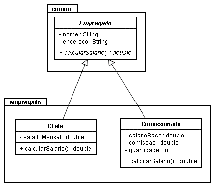

# 🧬 Projeto - Herança e Classe Abstrata

O objetivo deste projeto é implementar um conjunto de classes em C++ com base em um diagrama UML fornecido, realizar operações de manipulação de dados e aplicar conceitos de polimorfismo e ordenação. Acesse a solução [aqui](../main.cpp).

## 📋 Requisitos do projeto

### 📊 Diagrama de Classes
O projeto se baseia no seguinte diagrama de classes:
<p>
</p>

### Implementação das Classes
- As classes do diagrama devem ser implementadas em C++.
- A classe Empregado é uma classe abstrata, e o método calcularSalario() da classe Empregado é um método abstrato.
- Os modificadores de acesso dos atributos e métodos devem ser considerados de acordo com o diagrama.
- O método calcularSalario() da classe Comissionado retorna o valor da expressão (salarioBase + comissao * quantidade).
- sobrecarga dos métodos construtores deve ser ajustada, e o tipo de polimorfismo utilizado deve ser informado nos comentários.
### Vetor de Departamentos
- Deve ser implementado um vetor chamado "departamento" que contenha pelo menos 2 chefes e 3 comissionados.
A abordagem escolhida para a implementação do vetor pode ser um std::vector ou um array, de acordo com a preferência do desenvolvedor.
- Caso seja utilizado um std::vector, o vetor estará alocado na memória livre (heap). Caso seja utilizado um array, o vetor estará alocado no segmento de pilha (stack). Essa informação deve ser documentada nos comentários.

### Persistência de Dados
- Deve ser implementada uma forma de salvar o vetor de objetos "departamento" em um arquivo binário usando std::fstream.
- Em seguida, deve ser realizada a recuperação do vetor de objetos em uma nova variável.

### Ordenação do Vetor
- A função ordenaPorSalario deve ser alterada para ordenar o vetor pelo salário calculado usando templates.
- A função original só ordena arranjos de elementos do tipo int, portanto, deve ser adaptada para funcionar como um template para qualquer tipo numérico.
- O tipo de polimorfismo utilizado deve ser informado nos comentários do código.
- Após a ordenação, o vetor deve ser impresso de forma ordenada.

## 🛠️ Implementação do Projeto
Este projeto consiste na implementação de classes em C++ que representam um sistema de gerenciamento de funcionários em um departamento. As classes implementadas são Empregado, Chefe e Comissionado, e seguem as especificações definidas no diagrama de classes fornecido.

### Classe Empregado
- A classe Empregado é uma classe abstrata que serve como base para as classes Chefe e Comissionado. Ela possui dois atributos privados: nome e endereco. Essa classe também possui um construtor padrão, um construtor com parâmetros, um destrutor e um método virtual puro calcularSalario(). O método getNome() é público e permite obter o nome do empregado.
```cpp
class Empregado {
private:
  string nome;
  string endereco;

public:
  Empregado() {}
  Empregado(string nome, string endereco) : nome(nome), endereco(endereco) {}
  virtual ~Empregado() {}
  virtual double calcularSalario() = 0;
  string getNome() const { return nome; }
};
```

### Classe Chefe
- A classe Chefe é uma classe derivada da classe Empregado. Ela adiciona um atributo privado salarioMensal, que representa o salário mensal do chefe. A classe possui um construtor padrão, um construtor com parâmetros e um destrutor. Além disso, ela implementa o método calcularSalario() para retornar o salário mensal do chefe.
```cpp
class Chefe : public Empregado {
private:
  double salarioMensal;

public:
  Chefe() {}
  Chefe(string nome, string endereco, double salarioMensal)
      : Empregado(nome, endereco), salarioMensal(salarioMensal) {}
  ~Chefe() {}
  double calcularSalario() override { return salarioMensal; }
};
```

### Classe Comissionado
- A classe Comissionado também é uma classe derivada da classe Empregado. Ela adiciona três atributos privados: salarioBase, comissao e quantidade. Esses atributos representam o salário base, a comissão por venda e a quantidade de vendas do funcionário comissionado, respectivamente. A classe possui um construtor padrão, um construtor com parâmetros e um destrutor. Além disso, ela implementa o método calcularSalario() para calcular o salário do funcionário comissionado.
```cpp
class Comissionado : public Empregado {
private:
  double salarioBase;
  double comissao;
  int quantidade;

public:
  Comissionado() {}
  Comissionado(string nome, string endereco, double salarioBase,
               double comissao, int quantidade)
      : Empregado(nome, endereco), salarioBase(salarioBase), comissao(comissao),
        quantidade(quantidade) {}
  ~Comissionado() {}
  double calcularSalario() override { return salarioBase + (comissao * quantidade); }
};
```

### Vetor "departamento"
- O projeto inclui a implementação de um vetor chamado "departamento" que armazena os objetos dos funcionários. Nesse caso, o vetor é declarado como um array de ponteiros para Empregado. A alocação dos objetos é feita de forma dinâmica na memória livre (heap), enquanto o vetor em si está alocado no segmento de pilha (stack). O vetor é preenchido com dois objetos Chefe e três objetos Comissionado.
```cpp
  int tam = 5;
  Empregado *departamento[tam];

  Empregado *com1 = new Comissionado("matheus", "cc", 1000.40, 100, 3);
  Empregado *com2 = new Comissionado("isa", "ss", 2000.40, 50, 5);
  Empregado *com3 = new Comissionado("jose", "ll", 800.20, 150, 1);
  Empregado *chefe1 = new Chefe("francisco", "Ff", 5000.90);
  Empregado *chefe2 = new Chefe("jonas", "Jj", 6000.80);
  
  departamento[0] = com1;
  departamento[1] = com2;
  departamento[2] = com3;
  departamento[3] = chefe1;
  departamento[4] = chefe2;
```
### Salvando e recuperando o vetor de objetos
- O projeto também inclui uma implementação para salvar o vetor de objetos "departamento" em um arquivo binário usando a biblioteca fstream. A função ofstream é utilizada para abrir o arquivo no modo de escrita binária. Em seguida, o vetor é salvo no arquivo através da função write, que realiza a escrita dos bytes dos objetos no arquivo. Para recuperar o vetor de objetos, é utilizado o ifstream para abrir o arquivo no modo de leitura binária. A função read é utilizada para ler os bytes do arquivo e preencher o vetor de objetos "departamento2" com os dados lidos.
```cpp
ofstream file("arquivo.bin", ios::binary);
  if (!file.is_open()) {
    cout << "Não foi possível abrir o arquivo para a escrita." << endl;
    return 1;
  }

  file.write(reinterpret_cast<char *>(departamento), sizeof(Empregado *) * tam);
  cout << "Dados salvos..." << endl << endl;
  file.close();

  Empregado *departamento2[tam];

  ifstream file2("arquivo.bin", ios::binary);
  if (!file2.is_open()) {
    cout << "Não foi possível abrir o arquivo para leitura." << endl;
    return 1;
  }

  file2.read(reinterpret_cast<char *>(departamento2), sizeof(Empregado *) * tam);
  cout << "Dados lidos..." << endl << endl;
  file2.close();

  for (int i = 0; i < tam; i++) {
    cout << departamento2[i]->getNome() << endl;
  }
```
### Ordenação do vetor por salário
- O projeto inclui uma função chamada ordenaPorSalario, que é adaptada para funcionar como um template para qualquer tipo numérico. A função utiliza o algoritmo de ordenação de seleção para ordenar o vetor pelo salário calculado de cada objeto. O tipo de polimorfismo utilizado nesse caso é o polimorfismo de sobrecarga de função, permitindo a ordenação do vetor independentemente do tipo dos objetos.
```cpp
template <typename T>
void ordenaPorSalario(T d[], int N) {
  T aux;
  int indMenor;
  int i, j;
  for (i = 0; i < N - 1; i++) {
    indMenor = i;
    for (j = i + 1; j < N; j++) {
      if (d[j]->calcularSalario() < d[indMenor]->calcularSalario()) {
        indMenor = j;
      }
    }
    aux = d[i];
    d[i] = d[indMenor];
    d[indMenor] = aux;
  }
}
```
### 📝 Resultados
- Ao final do programa, são impressos os nomes dos funcionários do vetor "departamento2" e os salários ordenados em ordem crescente. Os objetos são desalocados da memória usando o operador delete.
- É importante destacar que o código fornecido está estruturado para atender aos requisitos do projeto e realizar as operações descritas.

## 📌 Considerações Finais
O projeto demonstra a aplicação de conceitos de programação orientada a objetos em C++, como a implementação de classes, herança, polimorfismo, sobrecarga de métodos e ordenação. Além disso, o projeto também envolve a manipulação de vetores, alocação dinâmica de memória, persistência de dados em arquivos binários e uso de templates.

O código foi desenvolvido de acordo com as especificações fornecidas no enunciado, seguindo as boas práticas de programação e organização de código. O projeto pode ser modificado e expandido de acordo com as necessidades e requisitos adicionais.